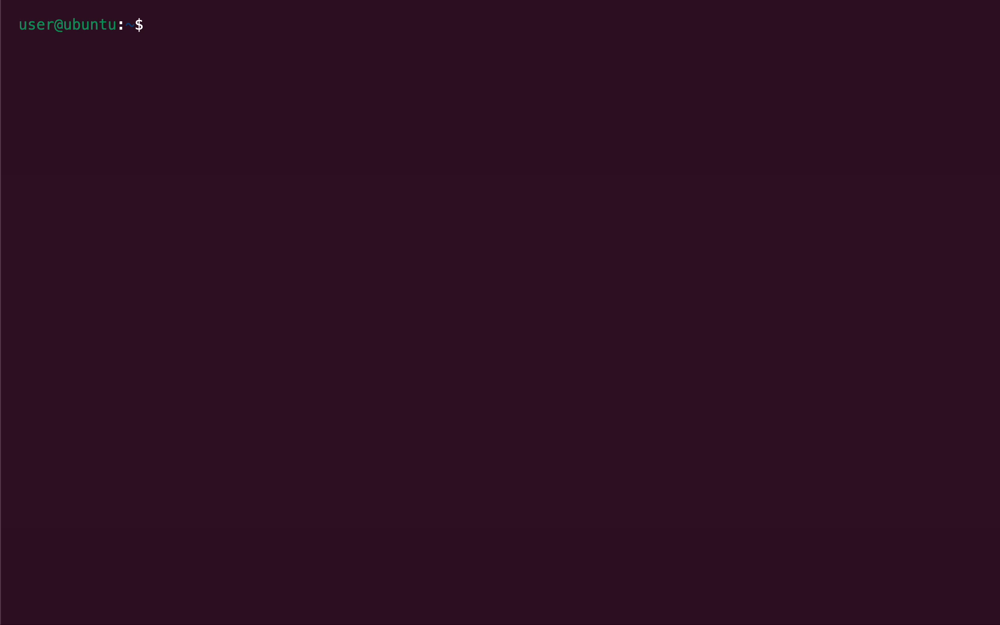

# Proto\*


<small>A CLI prototype of a task manager.</small>

Proto\* is a tool for creating interactive CLI prototypes using a simple JSON configuration file. The tool generates a website that emulates a terminal, with only the CLI defined in the configuration file being available. It's designed for quick and easy creation of CLI prototypes, enabling rapid iterations.
The tool automatically deploys to GitHub Pages, allowing prototypes to be easily shared. This makes it suitable for user testing, as users can access the prototype through a simple link rather than having to install anything.

## Prerequisites

You have to have [git](https://git-scm.com/downloads), [node](https://nodejs.org/en/download/package-manager) and [yarn](https://classic.yarnpkg.com/lang/en/docs/install/) installed.

## Setup and Usage

1. Fork this repository to your GitHub account.
2. Clone your forked repository:

```bash
git clone https://github.com/your-username/cli-prototype.git
cd cli-prototype
```

3. Install dependencies:

```bash
yarn install
```

4. Run the development server:

```bash
yarn run dev
```

5. Open the provided URL in your web browser to interact with your CLI prototype.

## Deployment

This project is set up to deploy automatically to GitHub Pages using GitHub Actions:

1. In your forked repository, go to Settings > Pages.
2. Under "Source", select "GitHub Actions".
3. The site will deploy automatically on pushes to the main branch.
4. You can find the deployed site URL in the GitHub Actions workflow runs.

## Customizing Your CLI

This prototyping tool is build in a way so that the only file you need to change to customize your CLI prototype is the `src/commands.json` file.
The general schema of the `commands.json` is:

```json
{
    // Welcome message for the CLI prototype
    "welcome": "Welcome to My CLI! Type 'help' for available commands.",

    // The global variables you can read and write accross commands
    "variables": {
        "username": "dgtlntv",
        "isLoggedIn": "false"
    },
    "commands": {
        // The commands available in the CLI prototype
    }
}
```

-   `welcome` is optional. It defines a welcome message that is output when the CLI is loaded for the first time.
-   `variables` is optional as well and can be used to define variables that can be set and checked by commands. For example, through them we can prescribe a specific command sequence.
-   The commands of the CLI are defined in the commands object.

### Commands

#### Command name

The command name with which the command can be called is the key of the command object. In this example we are creating a `register` command:

```json
{
    "commands": {
        "register": {
            // Command content
        }
    }
}
```

##### Description

The description is shown in the automatically generated help message.

```json
{
    "commands": {
        "register": {
            "description": "This command registers a new account with the service."
        }
    }
}
```

##### Alias

An alias allows you to call the same command with a different command name. Can either be a single string or an array of strings.
In the following example the user could call the same `register`command with `enrol` or `signup` now.

```json
{
    "commands": {
        "register": {
            "alias": ["enrol", "signup"]
        }
    }
}
```

##### Example

The example will be used to provide example usages of a command in the automatically generated help message. Can be a single example [command, description] or an array of such examples.

```json
{
    "commands": {
        "register": {
            "example": [
                "register email@example.com",
                "Register a new account with the email@example.com email."
            ]
        }
    }
}
```

##### Positional arguments

Positional arguments in commands can be either required or optional. Required positional arguments are denoted as `<email>`, while optional arguments are represented as `[username]`.

```json
{
    "commands": {
        "register <email> [username]": {
            // Command content
        }
    }
}
```

The `|` character allows you to specify aliases for positional arguments.

```json
{
    "commands": {
        "register <email | username>": {
            // Command content
        }
    }
}
```

The last positional argument can optionally accept an array of values, by using the `..` operator:

```json
{
    "commands": {
        "register <email> [..socialUrls]": {
            // Command content
        }
    }
}
```

Under `positional` the positional argument of a command are defined. You can use the following fields to describe the positional arguments:

| Field        | Description                                                                                                                   |
| ------------ | ----------------------------------------------------------------------------------------------------------------------------- |
| alias        | Alternative name(s) for the positional argument.                                                                              |
| choices      | An array of valid values for this positional argument.                                                                        |
| default      | The default value for this positional argument if not provided.                                                               |
| demandOption | Marks the argument as required. If true, the command will fail without it. If a string, it will be used as the error message. |
| description  | A short description of the positional argument.                                                                               |
| type         | The expected data type of the positional argument (boolean, number, string).                                                  |

```json
{
    "commands": {
        "register <email>": {
            "positional": {
                "email": {
                    "alias": "username",
                    // choice and default don't really make sense in this example, but is an available configuration
                    // "choices": [
                    //     "choice1",
                    //     "choice2",
                    //     "choice3"
                    // ],
                    // "default": "defaultOption",
                    "demandOption": true,
                    "description": "The email to register your account with",
                    "type": "string"
                }
            }
        }
    }
}
```

##### Options / flags

Under `options` the flags (eg. `--flag`) of a command are defined. You can use the following fields to describe the options/flags:

| Field              | Description                                                                                                                   |
| ------------------ | ----------------------------------------------------------------------------------------------------------------------------- |
| alias              | Alternative name(s) for the positional argument.                                                                              |
| choices            | An array of valid values for this positional argument.                                                                        |
| default            | The default value for this positional argument if not provided.                                                               |
| defaultDescription | A description of the default value.                                                                                           |
| demandOption       | Marks the argument as required. If true, the command will fail without it. If a string, it will be used as the error message. |
| description        | A short description of the positional argument.                                                                               |
| group              | The group to which this option belongs, used for grouping related options in help output.                                     |
| hidden             | If true, the option will not be shown in help output.                                                                         |
| nargs              | The number of arguments to be consumed by this option.                                                                        |
| requiresArg        | If true, the option must be specified with a value.                                                                           |
| type               | The expected data type of the positional argument (boolean, number, string).                                                  |

```json
{
    "commands": {
        "register": {
            "options": {
                "password": {
                    "alias": ["pwd", "pw"],
                    // choice and default don't really make sense in this example, but is an available configuration
                    // "choices": [
                    //     "choice1",
                    //     "choice2",
                    //     "choice3"
                    // ],
                    // "default": "defaultOption",
                    // "defaultDescription": "The description for the default option",
                    "demandOption": true,
                    "description": "The password for your account",
                    "group": "Login credentials",
                    "hidden": false,
                    "nargs": 1,
                    "requiresArg": true,
                    "type": "string"
                }
            }
        }
    }
}
```

##### Sub-commands

If you want to chain multiple commands you can nest commands under `commands`. The commands defined under `commands` allow for the exact same configuration as a root command.

```json
{
    "commands": {
        "register": {
            "commands": {
                "user": {
                    // Command content
                },
                "serviceaccount": {
                    // Command content
                }
            }
        }
    }
}
```

##### Handler

Under `handler` the response to a command is defined. The handler accepts the components available in the CLI prototyping tool. The available components are the following:

| Component    | Description                                                                                               |
| ------------ | --------------------------------------------------------------------------------------------------------- |
| text         | Prints text to the terminal.                                                                              |
| progressBar  | Renders a progress bar to the terminal.                                                                   |
| spinner      | Renders a spinner to the terminal.                                                                        |
| table        | Renders a table to the terminal.                                                                          |
| conditional  | Evaluates a condition and then executes a component based on if the condition evaluated to true or false. |
| variable     | Saves a value to a global variable.                                                                       |
| autoComplete | Prompt that auto-completes as the user types.                                                             |
| basicAuth    | Prompt for username and password authentication.                                                          |
| confirm      | Prompt to confirm or deny a statement.                                                                    |
| form         | Prompt for multiple values on a single terminal screen.                                                   |
| input        | Prompt for user input.                                                                                    |
| invisible    | Prompt for user input, hiding it from the terminal.                                                       |
| list         | Prompt returning a list of values, created by splitting user input.                                       |
| multiSelect  | Prompt allowing selection of multiple items from a list of options.                                       |
| number       | Prompt that takes a number as input.                                                                      |
| password     | Prompt that takes user input and masks it in the terminal.                                                |
| quiz         | Prompt for multiple-choice quiz questions.                                                                |
| survey       | Prompt for user feedback on a list of questions using a defined scale.                                    |
| scale        | Compact version of Survey prompt using a Likert Scale for quick feedback.                                 |
| select       | Prompt for selecting from a list of options.                                                              |
| sort         | Prompt for sorting items in a list.                                                                       |
| snippet      | Prompt for replacing placeholders in a snippet of code or text.                                           |
| toggle       | Prompt for toggling between two values.                                                                   |

The handler accepts either a single component:

```json
{
    "commands": {
        "register": {
            "handler": {
                "component": "text",
                "output": "Registered successfully"
            }
        }
    }
}
```

Or an array of components:

```json
{
    "commands": {
        "register": {
            "handler": [
                {
                    "component": "text",
                    "output": "Registering in progress...",
                    "duration": 5000
                },
                {
                    "component": "text",
                    "output": "Registered successfully"
                }
            ]
        }
    }
}
```

The following section explains each available component more in depth:

## Components

A component corresponds to something that can happen as a reaction to a command. Multiple components can be linked together to happen in sequence. See the handler documentation.

### Text


The simplest of the components is the text component. It simply prints text to the terminal, while optionally waiting for some time after printing the text to the terminal.

| field    | required/optional | Description                                                                                                                                                         |
| -------- | ----------------- | ------------------------------------------------------------------------------------------------------------------------------------------------------------------- |
| output   | required          | The text that should be printed to the terminal                                                                                                                     |
| duration | optional          | The duration (in milliseconds) that should be waited after printing the text. Also accepts "random" which will wait for a random duration between 100ms and 3000ms. |

```json
{
    "commands": {
        "register": {
            "handler": [
                {
                    "component": "text",
                    "output": "Registering in progress...",
                    "duration": 2000
                },
                {
                    "component": "text",
                    "output": "Registered successfully"
                }
            ]
        }
    }
}
```

---

### Progress bar


The progress bar component renders a progress bar in the terminal, showing a task's completion over time.

| field    | required/optional | Description                                                                                                                                       |
| -------- | ----------------- | ------------------------------------------------------------------------------------------------------------------------------------------------- |
| output   | required          | The text displayed alongside the progress bar                                                                                                     |
| duration | required          | The duration (in milliseconds) for the progress bar to complete. Also accepts "random" which will use a random duration between 100ms and 3000ms. |

```json
{
    "commands": {
        "install": {
            "handler": {
                "component": "progressBar",
                "output": "Installing dependencies...",
                "duration": 2000
            }
        }
    }
}
```

---

### Spinner


The spinner component displays an animated spinner in the terminal, indicating that a process is ongoing.

| field      | required/optional | Description                                                                                                                                       |
| ---------- | ----------------- | ------------------------------------------------------------------------------------------------------------------------------------------------- |
| output     | required          | The text or array of texts displayed alongside the spinner                                                                                        |
| duration   | required          | The duration (in milliseconds) for which the spinner should run. Also accepts "random" which will use a random duration between 100ms and 3000ms. |
| conclusion | optional          | Specifies how the spinner should conclude its animation. Can be `stop`, `success`, or `fail`.                                                     |

```json
{
    "commands": {
        "process": {
            "handler": {
                "component": "spinner",
                "output": ["Processing", "Please wait", "Almost done"],
                "duration": 2000,
                "conclusion": "succeed"
            }
        }
    }
}
```

---

### Table


The table component renders a formatted table in the terminal.

| field     | required/optional | Description                                                                                                                                                         |
| --------- | ----------------- | ------------------------------------------------------------------------------------------------------------------------------------------------------------------- |
| output    | required          | A 2D array representing the table data, including headers if desired.                                                                                               |
| colWidths | optional          | An array of numbers representing the width of each column in the table. If this is not set the table will hug its content, until the table fills the terminal size. |

```json
{
    "commands": {
        "list": {
            "handler": {
                "component": "table",
                "output": [
                    ["Name", "Age", "City"],
                    ["John", "30", "New York"],
                    ["Alice", "25", "London"]
                ],
                "colWidths": [10, 5, 15]
            }
        }
    }
}
```

---

### Conditional


The conditional component allows for branching logic based on a condition.

| field  | required/optional | Description                                                     |
| ------ | ----------------- | --------------------------------------------------------------- |
| output | required          | An object containing "if", "then", and optionally "else" fields |

The output object should contain the following fields.

| field | required/optional | Description                                                                                                                                |
| ----- | ----------------- | ------------------------------------------------------------------------------------------------------------------------------------------ |
| if    | required          | A string representing the condition to be evaluated                                                                                        |
| then  | required          | The component to be executed if the condition is true. You can provide another conditional component as well.                              |
| else  | optional          | The component to be executed if the condition is false (if this field is provided). You can provide another conditional component as well. |

```json
{
    "commands": {
        "check": {
            "handler": {
                "component": "conditional",
                "output": {
                    "if": "isLoggedIn == 'true'",
                    "then": {
                        "component": "text",
                        "output": "Welcome back!"
                    },
                    "else": {
                        "component": "text",
                        "output": "Please log in first."
                    }
                }
            }
        }
    }
}
```

---

### Variable



The variable component allows setting global variables that can be used across commands. For the setting of the variable to be succesfull it needs to be initialized as a global variable in the CLIs global variables.

| field  | required/optional | Description                                                    |
| ------ | ----------------- | -------------------------------------------------------------- |
| output | required          | An object where keys are variable names and values are strings |

```json
{
    "commands": {
        "login": {
            "handler": [
                {
                    "component": "text",
                    "output": "Before setting the variables username is {{username}} and isLoggedin is {{isLoggedIn}}"
                },
                {
                    "component": "variable",
                    "output": {
                        "username": "john_doe",
                        "isLoggedIn": "true"
                    }
                },
                {
                    "component": "text",
                    "output": "After setting the variables username is {{username}} and isLoggedin is {{isLoggedIn}}"
                }
            ]
        }
    }
}
```

---

### AutoComplete


The autoComplete component provides a prompt that auto-completes as the user types.

| field    | required/optional | Description                                                |
| -------- | ----------------- | ---------------------------------------------------------- |
| name     | required          | Identifier for accessing the prompt's result               |
| message  | required          | Message to display with the prompt in the terminal         |
| choices  | required          | List of items for user selection                           |
| limit    | optional          | Number of choices to display on-screen                     |
| initial  | optional          | The index of the initial selection                         |
| multiple | optional          | Allows selection of multiple choices                       |
| footer   | optional          | Optional message in muted color providing interaction hint |

```json
{
    "commands": {
        "search": {
            "handler": {
                "component": "autoComplete",
                "name": "query",
                "message": "Search for a fruit:",
                "choices": ["Apple", "Banana", "Cherry", "Date", "Elderberry"],
                "limit": 3,
                "footer": "Use arrow keys to navigate"
            }
        }
    }
}
```

---

### BasicAuth


The basicAuth component prompts for username and password authentication.

| field        | required/optional | Description                                        |
| ------------ | ----------------- | -------------------------------------------------- |
| name         | required          | Identifier for accessing the prompt's result       |
| message      | required          | Message to display with the prompt in the terminal |
| username     | required          | Username to compare against                        |
| password     | required          | Password to compare against                        |
| showPassword | optional          | Determines whether to hide or show the password    |

```json
{
    "commands": {
        "login": {
            "handler": {
                "component": "basicAuth",
                "name": "auth",
                "message": "Please enter your credentials:",
                "username": "admin",
                "password": "secret",
                "showPassword": false
            }
        }
    }
}
```

---

### Confirm


The confirm component prompts to confirm or deny a statement.

| field   | required/optional | Description                                    |
| ------- | ----------------- | ---------------------------------------------- |
| name    | required          | Identifier for accessing the prompt's result   |
| message | required          | Question to be confirmed or denied             |
| initial | optional          | Set whether the initial value is true or false |

```json
{
    "commands": {
        "delete": {
            "handler": {
                "component": "confirm",
                "name": "confirmDelete",
                "message": "Are you sure you want to delete this item?",
                "initial": false
            }
        }
    }
}
```

---

### Form


The form component prompts for multiple values on a single terminal screen.

| field   | required/optional | Description                                      |
| ------- | ----------------- | ------------------------------------------------ |
| name    | required          | Identifier for accessing the form's results      |
| message | required          | Message to display with the form in the terminal |
| choices | required          | Array of form fields                             |

Each choice in the choices array should have the following properties:

| field   | required/optional | Description                             |
| ------- | ----------------- | --------------------------------------- |
| name    | required          | Identifier for the form field           |
| message | required          | Label for the form field                |
| initial | optional          | Initial placeholder value for the field |

```json
{
    "commands": {
        "register": {
            "handler": {
                "component": "form",
                "name": "userInfo",
                "message": "Please enter your information:",
                "choices": [
                    {
                        "name": "username",
                        "message": "Username:",
                        "initial": "user123"
                    },
                    {
                        "name": "email",
                        "message": "Email:"
                    }
                ]
            }
        }
    }
}
```

---

### Input


The input component prompts for user input.

| field   | required/optional | Description                                 |
| ------- | ----------------- | ------------------------------------------- |
| name    | required          | Identifier for accessing the input's result |
| message | required          | Question or prompt for user input           |
| initial | optional          | Initial placeholder value                   |

```json
{
    "commands": {
        "name": {
            "handler": {
                "component": "input",
                "name": "username",
                "message": "What's your name?",
                "initial": "Anonymous"
            }
        }
    }
}
```

---

### Invisible


The invisible component prompts for user input, hiding it from the terminal.

| field   | required/optional | Description                                 |
| ------- | ----------------- | ------------------------------------------- |
| name    | required          | Identifier for accessing the input's result |
| message | required          | Question or prompt for hidden user input    |

```json
{
    "commands": {
        "password": {
            "handler": {
                "component": "invisible",
                "name": "password",
                "message": "Enter your password:"
            }
        }
    }
}
```

---

### List


The list component prompts for a list of values, created by splitting user input.

| field   | required/optional | Description                                |
| ------- | ----------------- | ------------------------------------------ |
| name    | required          | Identifier for accessing the list's result |
| message | required          | Question or prompt for list input          |

```json
{
    "commands": {
        "tags": {
            "handler": {
                "component": "list",
                "name": "tags",
                "message": "Enter tags (comma-separated):"
            }
        }
    }
}
```

---

### MultiSelect


The multiSelect component allows selection of multiple items from a list of options.

| field   | required/optional | Description                                    |
| ------- | ----------------- | ---------------------------------------------- |
| name    | required          | Identifier for accessing the selection results |
| message | required          | Message to display with the selection prompt   |
| choices | required          | Array of selectable options                    |
| limit   | optional          | Number of choices to display on-screen         |

Each choice in the choices array should have the following properties:

| field | required/optional | Description                      |
| ----- | ----------------- | -------------------------------- |
| name  | required          | Display text for the choice      |
| value | required          | Value to be returned if selected |

```json
{
    "commands": {
        "features": {
            "handler": {
                "component": "multiSelect",
                "name": "features",
                "message": "Select desired features:",
                "choices": [
                    { "name": "Auto-save", "value": "autosave" },
                    { "name": "Dark mode", "value": "darkmode" },
                    { "name": "Notifications", "value": "notifications" }
                ],
                "limit": 2
            }
        }
    }
}
```

---

### Number


The number component prompts for a numeric input.

| field   | required/optional | Description                                      |
| ------- | ----------------- | ------------------------------------------------ |
| name    | required          | Identifier for accessing the number input result |
| message | required          | Question or prompt for number input              |

```json
{
    "commands": {
        "age": {
            "handler": {
                "component": "number",
                "name": "age",
                "message": "Enter your age:"
            }
        }
    }
}
```

---

### Password


The password component prompts for a password, masking the input in the terminal.

| field   | required/optional | Description                                        |
| ------- | ----------------- | -------------------------------------------------- |
| name    | required          | Identifier for accessing the password input result |
| message | required          | Question or prompt for password input              |

```json
{
    "commands": {
        "password": {
            "handler": {
                "component": "password",
                "name": "newPassword",
                "message": "Enter new password:"
            }
        }
    }
}
```

---

### Quiz


The quiz component presents multiple-choice quiz questions.

| field         | required/optional | Description                                        |
| ------------- | ----------------- | -------------------------------------------------- |
| name          | required          | Identifier for accessing the quiz result           |
| message       | required          | Quiz question to display                           |
| choices       | required          | List of possible answers to the quiz question      |
| correctChoice | required          | Index of the correct choice from the choices array |

```json
{
    "commands": {
        "quiz": {
            "handler": {
                "component": "quiz",
                "name": "capitalQuiz",
                "message": "What is the capital of France?",
                "choices": ["London", "Berlin", "Paris", "Madrid"],
                "correctChoice": 2
            }
        }
    }
}
```

---

### Survey


The survey component prompts for user feedback on a list of questions using a defined scale.

| field   | required/optional | Description                                 |
| ------- | ----------------- | ------------------------------------------- |
| name    | required          | Identifier for accessing the survey results |
| message | required          | Message to display with the survey prompt   |
| scale   | required          | Definition of the survey scale              |
| choices | required          | List of survey questions                    |

Each item in the scale array should have:

| field   | required/optional | Description                          |
| ------- | ----------------- | ------------------------------------ |
| name    | required          | Label for the scale point            |
| message | required          | Explanation text for the scale point |

Each item in the choices array should have:

| field   | required/optional | Description                        |
| ------- | ----------------- | ---------------------------------- |
| name    | required          | Identifier for the survey question |
| message | required          | Survey question text               |

```json
{
    "commands": {
        "feedback": {
            "handler": {
                "component": "survey",
                "name": "userSatisfaction",
                "message": "Please rate your experience:",
                "scale": [
                    { "name": "1", "message": "Strongly Disagree" },
                    { "name": "3", "message": "Neutral" },
                    { "name": "5", "message": "Strongly Agree" }
                ],
                "choices": [
                    {
                        "name": "easeOfUse",
                        "message": "The product was easy to use"
                    },
                    {
                        "name": "features",
                        "message": "The product had all the features I needed"
                    }
                ]
            }
        }
    }
}
```

---

### Scale


The scale component is a compact version of the Survey prompt, using a Likert Scale for quick feedback.

| field   | required/optional | Description                                |
| ------- | ----------------- | ------------------------------------------ |
| name    | required          | Identifier for accessing the scale results |
| message | required          | Message to display with the scale prompt   |
| scale   | required          | Definition of the scale                    |
| choices | required          | List of scale questions                    |

Each item in the scale array should have:

| field   | required/optional | Description                          |
| ------- | ----------------- | ------------------------------------ |
| name    | required          | Label for the scale point            |
| message | required          | Explanation text for the scale point |

Each item in the choices array should have:

| field   | required/optional | Description                 |
| ------- | ----------------- | --------------------------- |
| name    | required          | Identifier for the question |
| message | required          | Question text               |
| initial | optional          | Index of the initial value  |

```json
{
    "commands": {
        "feedback": {
            "handler": {
                "component": "scale",
                "name": "productRating",
                "message": "Rate our product:",
                "scale": [
                    { "name": "1", "message": "Poor" },
                    { "name": "3", "message": "Average" },
                    { "name": "5", "message": "Excellent" }
                ],
                "choices": [
                    {
                        "name": "overall",
                        "message": "Overall satisfaction",
                        "initial": 3
                    },
                    { "name": "support", "message": "Customer support" }
                ]
            }
        }
    }
}
```

---

### Select


The select component prompts for selecting from a list of options.

| field   | required/optional | Description                                   |
| ------- | ----------------- | --------------------------------------------- |
| name    | required          | Identifier for accessing the selection result |
| message | required          | Message to display with the selection prompt  |
| choices | required          | List of options to select from                |

The choices can be either an array of strings or an array of objects with name and value properties:

| field | required/optional | Description                      |
| ----- | ----------------- | -------------------------------- |
| name  | required          | Display text for the choice      |
| value | required          | Value to be returned if selected |

```json
{
    "commands": {
        "color": {
            "handler": {
                "component": "select",
                "name": "favoriteColor",
                "message": "Choose your favorite color:",
                "choices": [
                    { "name": "Red", "value": "red" },
                    { "name": "Blue", "value": "blue" },
                    { "name": "Green", "value": "green" }
                ]
            }
        }
    }
}
```

---

### Sort


The sort component prompts for sorting items in a list.

| field   | required/optional | Description                                |
| ------- | ----------------- | ------------------------------------------ |
| name    | required          | Identifier for accessing the sorted result |
| message | required          | Message to display with the sorting prompt |
| choices | required          | List of items to be sorted                 |

```json
{
    "commands": {
        "tasks": {
            "handler": {
                "component": "sort",
                "name": "taskOrder",
                "message": "Sort these tasks by priority:",
                "choices": [
                    "Fix bugs",
                    "Implement new feature",
                    "Write documentation",
                    "Refactor code"
                ]
            }
        }
    }
}
```

---

### Snippet


The snippet component prompts for replacing placeholders in a snippet of code or text.

| field    | required/optional | Description                                                                                                                                                                                                                                                                                                             |
| -------- | ----------------- | ----------------------------------------------------------------------------------------------------------------------------------------------------------------------------------------------------------------------------------------------------------------------------------------------------------------------- |
| name     | required          | Identifier for accessing the completed snippet                                                                                                                                                                                                                                                                          |
| message  | required          | Message to display with the snippet prompt                                                                                                                                                                                                                                                                              |
| fields   | required          | List of fields to be filled in the snippet                                                                                                                                                                                                                                                                              |
| template | required          | String with placeholders marked as ${name}. Linebreaks in the template need to be indicated with newline characters `\n`. You can use [online tools](https://karl-horning.github.io/replace-newlines/) to do the conversion for you. Make sure to use single quotes if your template uses double quotes and vice versa. |

Each item in the fields array should have:

| field   | required/optional | Description                  |
| ------- | ----------------- | ---------------------------- |
| name    | required          | Identifier for the field     |
| message | required          | Prompt message for the field |

```json
{
    "commands": {
        "generate": {
            "handler": {
                "component": "snippet",
                "name": "package",
                "message": "Fill out the fields in package.json",
                "fields": [
                    { "name": "name", "message": "Name of the package" },
                    {
                        "name": "description",
                        "message": "Description of the package"
                    },
                    { "name": "version", "message": "Version of the package" },
                    { "name": "username", "message": "Your username" },
                    { "name": "author_name", "message": "Your name" },
                    {
                        "name": "license",
                        "message": "The license of the package"
                    }
                ],
                "template": "{\n  \"name\": \"${name}\",\n  \"description\": \"${description}\",\n  \"version\": \"${version}\",\n  \"homepage\": \"https://github.com/${username}/${name}\",\n  \"author\": \"${author_name} (https://github.com/${username})\",\n  \"repository\": \"${username}/${name}\",\n  \"license\": \"${license:ISC}\"\n}\n"
            }
        }
    }
}
```

---

### Toggle


The toggle component prompts for toggling between two values.

| field    | required/optional | Description                                |
| -------- | ----------------- | ------------------------------------------ |
| name     | required          | Identifier for accessing the toggle result |
| message  | required          | Message to display with the toggle prompt  |
| enabled  | required          | Label for the enabled state                |
| disabled | required          | Label for the disabled state               |

```json
{
    "commands": {
        "notifications": {
            "handler": {
                "component": "toggle",
                "name": "notificationsEnabled",
                "message": "Enable notifications?",
                "enabled": "Yes",
                "disabled": "No"
            }
        }
    }
}
```
