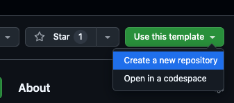
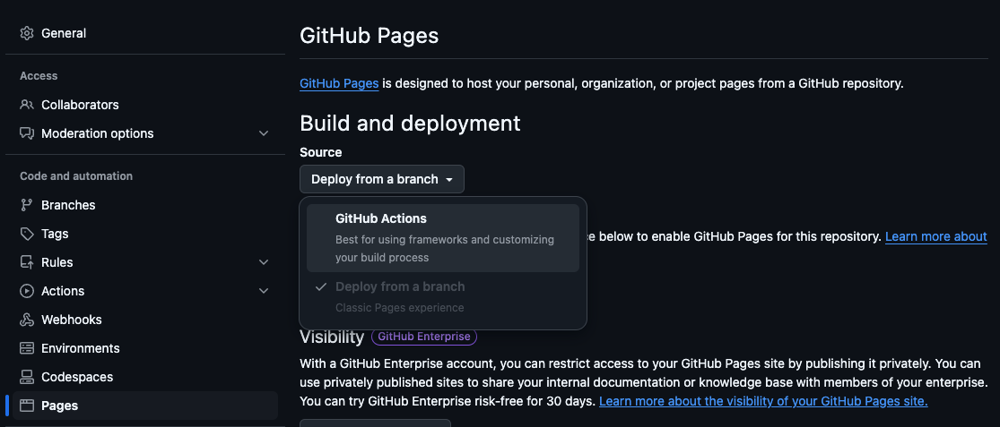
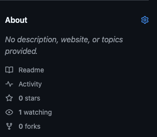
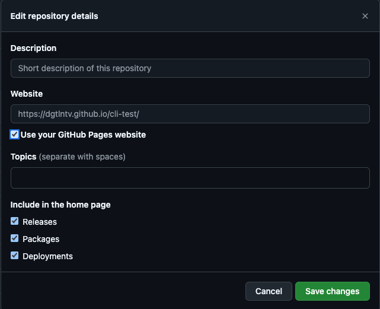
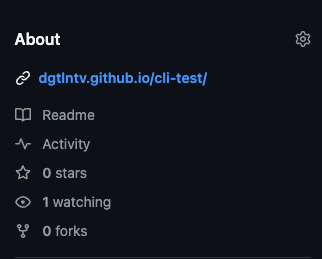
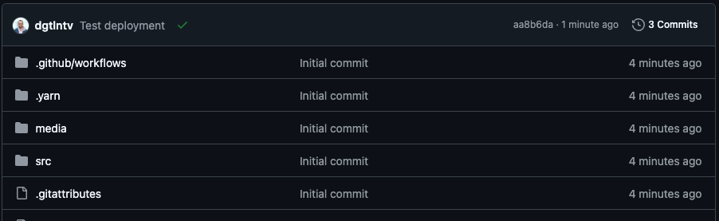

<h1 align="center">Proto*</h1>

<br>

<p align="center">
  <b>Quickly and easily create interactive CLI prototypes.</b><br>
  <sub>Enabling you to rapidly iterate, share a CLI concept with colleagues or do user testing.</sub>
</p>

<br>

<p align="center">
  <br>
  <sub>A "dummy" prototype of a task management CLI. You can see more interaction examples under <a href="#components">components</a></sub>
</p>

<br>
<br>

Proto\* is a tool for creating interactive CLI prototypes using a simple JSON configuration file. It generates a website that emulates a terminal, with only the CLI defined in the configuration file being available. It's designed for quick and easy creation of CLI prototypes, enabling rapid iterations.

The tool automatically deploys to GitHub Pages, allowing prototypes to be easily shared. This makes it suitable for user testing, as users can access the prototype through a simple link rather than having to install anything.

Prototypes can also be [shared as a URL](#sharing-via-url) without forking or deploying anything.

## Table of Contents

- [Setup](#setup)
- [Usage](#usage)
- [Deployment](#deployment)
- [Sharing via URL](#sharing-via-url)
- [Using as a Library](#using-protostar-as-a-library)
- [Customizing Your CLI](#customizing-your-cli)
  - [Commands](#commands)
- [Components](#components)

## Setup

### Prerequisites

- [git](https://git-scm.com/downloads)
- [Node.js](https://nodejs.org/en/download/package-manager) (v18+)
- [pnpm](https://pnpm.io/installation)

### Getting Started

1. Create a new repository using this repository as a template.

   

2. Clone the newly created repository:

   ```bash
   git clone https://github.com/your-username/cli-prototype.git
   cd cli-prototype
   ```

3. Install dependencies:

   ```bash
   pnpm install
   ```

4. Start the development server:

   ```bash
   pnpm dev
   ```

5. Open the provided URL in your browser to interact with your CLI prototype.

## Usage

Edit `packages/playground/src/commands.json` to define your CLI prototype. The development server hot-reloads on changes.

Run the test suites:

```bash
# Install Playwright browsers (first time only)
pnpm exec playwright install --with-deps chromium

# Unit tests
pnpm test:unit

# End-to-end tests
pnpm test:e2e
```

## Deployment

This project deploys automatically to GitHub Pages via GitHub Actions.

1. In your GitHub repository, go to **Settings > Pages**.
2. Under "Source", select **GitHub Actions**.

   

3. On the home page of your repository, click the settings icon of the "About" section.

   

4. Under website, check **"Use your GitHub Pages website"**.

   

5. Your GitHub Pages link will now show up in the "About" section.

   

6. The site deploys automatically on pushes to the main branch. A green checkmark confirms a successful deployment.

   

## Sharing via URL

Normally, creating a prototype means forking this repo, editing `commands.json`, and deploying your own GitHub Pages site. URL sharing removes that overhead entirely: you write (or generate) a `commands.json`, encode it, and get a link that loads your prototype on the main project's hosted playground. No fork, no deploy, no server.

This is especially useful when a coding agent generates the JSON for you. An agent can produce a `commands.json`, encode it, and hand you a link you can open in the browser immediately.

The encoding works by compressing the JSON config and packing it into the URL hash. Since the hash never leaves the browser, nothing is sent to a server.

**From the playground:** press **Ctrl+Shift+L** to copy a share URL to the clipboard.

**From the command line** using the `@dgtlntv/protostar-codec` package:

```bash
cat commands.json | pnpm exec protostar-encode
# → https://dgtlntv.github.io/protostar/#p1=<payload>
```

Open the resulting URL and the encoded prototype boots instead of the bundled demo.

## Using Protostar as a Library

You can integrate Protostar into your own JavaScript projects. The published bundle is self-contained, no shim aliases or polyfills required.

```bash
pnpm add @dgtlntv/protostar
```

```javascript
import "@xterm/xterm/css/xterm.css"
import "@dgtlntv/protostar/styles.css"
import { Protostar } from "@dgtlntv/protostar"
import commandsData from "./commands.json"

document.addEventListener("DOMContentLoaded", () => {
    const protostar = new Protostar(
        document.getElementById("terminal"),
        commandsData
    )
    protostar.start()
})
```

## Customizing Your CLI

The only file you need to change to customize your CLI prototype is `packages/playground/src/commands.json`. The general schema is:

```json5
{
    // Welcome message displayed when the CLI loads
    welcome: "Welcome to My CLI! Type 'help' for available commands.",

    // Global variables that can be read and written across commands
    variables: {
        username: "dgtlntv",
        isLoggedIn: "false",
    },

    // The commands available in the CLI
    commands: {},
}
```

- `welcome` is optional. It defines a welcome message shown when the CLI loads.
- `variables` is optional. Use it to define variables that can be set and checked by commands, enabling prescribed command sequences.
- `commands` defines the available CLI commands.

### Commands

#### Command name

The command name is the key of the command object:

```json5
{
    commands: {
        register: {
            // Command content
        },
    },
}
```

##### Description

Shown in the automatically generated help message.

```json5
{
    commands: {
        register: {
            description: "This command registers a new account with the service.",
        },
    },
}
```

##### Alias

Call the same command with a different name. Can be a string or array of strings.

```json5
{
    commands: {
        register: {
            alias: ["enrol", "signup"],
        },
    },
}
```

##### Example

Provides example usages in the help message. Can be a single `[command, description]` or an array.

```json5
{
    commands: {
        register: {
            example: [
                "register email@example.com",
                "Register a new account with the email@example.com email.",
            ],
        },
    },
}
```

##### Positional arguments

Required positional arguments use `<email>`, optional ones use `[username]`.

```json5
{
    commands: {
        "register <email> [username]": {
            // Command content
        },
    },
}
```

Use `|` for aliases: `<email | username>`. Use `..` for variadic: `[..socialUrls]`.

Under `positional`, describe each argument:

| Field        | Description                                                                                                                   |
| ------------ | ----------------------------------------------------------------------------------------------------------------------------- |
| alias        | Alternative name(s) for the positional argument.                                                                              |
| choices      | An array of valid values for this positional argument.                                                                        |
| default      | The default value if not provided.                                                                                            |
| demandOption | Marks the argument as required. If a string, used as the error message.                                                       |
| description  | A short description.                                                                                                          |
| type         | Expected data type (boolean, number, string).                                                                                 |

```json5
{
    commands: {
        "register <email>": {
            positional: {
                email: {
                    alias: "username",
                    demandOption: true,
                    description: "The email to register your account with",
                    type: "string",
                },
            },
        },
    },
}
```

##### Options / flags

Under `options`, define the flags (e.g., `--flag`) for a command:

| Field              | Description                                                                                                                   |
| ------------------ | ----------------------------------------------------------------------------------------------------------------------------- |
| alias              | Alternative name(s) for the option.                                                                                           |
| choices            | An array of valid values.                                                                                                     |
| default            | The default value if not provided.                                                                                            |
| defaultDescription | A description of the default value.                                                                                           |
| demandOption       | Marks the option as required. If a string, used as the error message.                                                         |
| description        | A short description.                                                                                                          |
| group              | Group for related options in help output.                                                                                     |
| hidden             | If true, hidden from help output.                                                                                             |
| nargs              | Number of arguments consumed by this option.                                                                                  |
| requiresArg        | If true, must be specified with a value.                                                                                      |
| type               | Expected data type (boolean, number, string).                                                                                 |

```json5
{
    commands: {
        register: {
            options: {
                password: {
                    alias: ["pwd", "pw"],
                    demandOption: true,
                    description: "The password for your account",
                    group: "Login credentials",
                    hidden: false,
                    nargs: 1,
                    requiresArg: true,
                    type: "string",
                },
            },
        },
    },
}
```

##### Sub-commands

Nest commands under `commands` to create sub-commands:

```json5
{
    commands: {
        register: {
            commands: {
                user: {
                    // Command content
                },
                serviceaccount: {
                    // Command content
                },
            },
        },
    },
}
```

##### Handler

Under `handler`, define the response to a command. The handler accepts one component or an array of components that run in sequence.

| Component    | Description                                                                      |
| ------------ | -------------------------------------------------------------------------------- |
| text         | Prints text to the terminal.                                                     |
| progressBar  | Renders a progress bar.                                                          |
| spinner      | Renders an animated spinner.                                                     |
| table        | Renders a table.                                                                 |
| conditional  | Evaluates a condition and executes a component based on the result.              |
| variable     | Saves a value to a global variable.                                              |
| autoComplete | Prompt that auto-completes as the user types.                                    |
| basicAuth    | Prompt for username and password authentication.                                 |
| confirm      | Prompt to confirm or deny a statement.                                           |
| form         | Prompt for multiple values on a single screen.                                   |
| input        | Prompt for user input.                                                           |
| invisible    | Prompt for user input, hiding it from the terminal.                              |
| list         | Prompt returning a list of values from comma-separated input.                    |
| multiSelect  | Prompt allowing selection of multiple items from a list.                         |
| number       | Prompt that takes a number as input.                                             |
| password     | Prompt that masks user input.                                                    |
| select       | Prompt for selecting from a list of options.                                     |
| sort         | Prompt for sorting items in a list.                                              |
| toggle       | Prompt for toggling between two values.                                          |

Single component:

```json5
{
    commands: {
        register: {
            handler: {
                component: "text",
                output: "Registered successfully",
            },
        },
    },
}
```

Array of components:

```json5
{
    commands: {
        register: {
            handler: [
                {
                    component: "text",
                    output: "Registering in progress...",
                    duration: 5000,
                },
                {
                    component: "text",
                    output: "Registered successfully",
                },
            ],
        },
    },
}
```

## Components

A component corresponds to something that happens as a reaction to a command. Multiple components can be chained to run in sequence.

### Text


Prints text to the terminal, optionally waiting for a duration afterward.

| Field    | Required | Description                                                                                                        |
| -------- | -------- | ------------------------------------------------------------------------------------------------------------------ |
| output   | Yes      | The text to print.                                                                                                 |
| duration | No       | Duration in ms to wait after printing. Also accepts `"random"` (100ms-3000ms).                                     |

```json5
{
    component: "text",
    output: "Registering in progress...",
    duration: 2000,
}
```

---

### Progress Bar


Renders a progress bar showing task completion over time.

| Field    | Required | Description                                                                                          |
| -------- | -------- | ---------------------------------------------------------------------------------------------------- |
| output   | Yes      | Text displayed alongside the progress bar.                                                           |
| duration | Yes      | Duration in ms for the bar to complete. Also accepts `"random"` (100ms-3000ms).                      |

```json5
{
    component: "progressBar",
    output: "Installing dependencies...",
    duration: 2000,
}
```

---

### Spinner


Displays an animated spinner indicating an ongoing process.

| Field      | Required | Description                                                                                          |
| ---------- | -------- | ---------------------------------------------------------------------------------------------------- |
| output     | Yes      | Text or array of texts displayed alongside the spinner.                                              |
| duration   | Yes      | Duration in ms. Also accepts `"random"` (100ms-3000ms).                                             |
| conclusion | No       | How the spinner concludes: `stop`, `success`, or `fail`.                                             |

```json5
{
    component: "spinner",
    output: ["Processing", "Please wait", "Almost done"],
    duration: 2000,
    conclusion: "succeed",
}
```

---

### Table


Renders a formatted table.

| Field     | Required | Description                                                                                                          |
| --------- | -------- | -------------------------------------------------------------------------------------------------------------------- |
| output    | Yes      | A 2D array representing table data (including headers).                                                              |
| colWidths | No       | Array of column widths. If not set, columns hug their content up to the terminal width.                              |

```json5
{
    component: "table",
    output: [
        ["Name", "Age", "City"],
        ["John", "30", "New York"],
        ["Alice", "25", "London"],
    ],
    colWidths: [10, 5, 15],
}
```

---

### Conditional


Branches logic based on a condition evaluated against global variables.

| Field  | Required | Description                                                          |
| ------ | -------- | -------------------------------------------------------------------- |
| output | Yes      | Object containing `if`, `then`, and optionally `else` fields.        |

The output object:

| Field | Required | Description                                                              |
| ----- | -------- | ------------------------------------------------------------------------ |
| if    | Yes      | Condition string to evaluate.                                            |
| then  | Yes      | Component to execute if true. Can be another conditional.                |
| else  | No       | Component to execute if false. Can be another conditional.               |

```json5
{
    component: "conditional",
    output: {
        if: "isLoggedIn == 'true'",
        then: {
            component: "text",
            output: "Welcome back!",
        },
        else: {
            component: "text",
            output: "Please log in first.",
        },
    },
}
```

---

### Variable


Sets global variables that can be used across commands. The variable must be declared in the top-level `variables` object.

| Field  | Required | Description                                                    |
| ------ | -------- | -------------------------------------------------------------- |
| output | Yes      | Object where keys are variable names and values are strings.   |

```json5
{
    component: "variable",
    output: {
        username: "john_doe",
        isLoggedIn: "true",
    },
}
```

---

### AutoComplete


Prompt that auto-completes as the user types.

| Field    | Required | Description                                        |
| -------- | -------- | -------------------------------------------------- |
| name     | Yes      | Identifier for the result.                         |
| message  | Yes      | Message displayed with the prompt.                 |
| choices  | Yes      | List of items for selection.                       |
| limit    | No       | Number of choices visible on-screen.               |
| initial  | No       | Index of the initial selection.                    |
| multiple | No       | Allow multiple selections.                         |
| footer   | No       | Muted hint message.                                |

```json5
{
    component: "autoComplete",
    name: "query",
    message: "Search for a fruit:",
    choices: ["Apple", "Banana", "Cherry", "Date", "Elderberry"],
    limit: 3,
    footer: "Use arrow keys to navigate",
}
```

---

### BasicAuth


Prompts for username and password authentication.

| Field        | Required | Description                                     |
| ------------ | -------- | ----------------------------------------------- |
| name         | Yes      | Identifier for the result.                      |
| message      | Yes      | Message displayed with the prompt.              |
| username     | Yes      | Username to compare against.                    |
| password     | Yes      | Password to compare against.                    |
| showPassword | No       | Whether to show the password.                   |

```json5
{
    component: "basicAuth",
    name: "auth",
    message: "Please enter your credentials:",
    username: "admin",
    password: "secret",
    showPassword: false,
}
```

---

### Confirm


Prompts to confirm or deny with a Y/n keystroke.

| Field   | Required | Description                                    |
| ------- | -------- | ---------------------------------------------- |
| name    | Yes      | Identifier for the result.                     |
| message | Yes      | Question to confirm or deny.                   |
| initial | No       | Initial value (true or false).                 |

```json5
{
    component: "confirm",
    name: "confirmDelete",
    message: "Are you sure you want to delete this item?",
    initial: false,
}
```

---

### Form


Prompts for multiple values on a single screen.

| Field   | Required | Description                                |
| ------- | -------- | ------------------------------------------ |
| name    | Yes      | Identifier for the form results.           |
| message | Yes      | Message displayed with the form.           |
| choices | Yes      | Array of form fields (see below).          |

Each choice:

| Field   | Required | Description                        |
| ------- | -------- | ---------------------------------- |
| name    | Yes      | Identifier for the field.          |
| message | Yes      | Label for the field.               |
| initial | No       | Initial placeholder value.         |

```json5
{
    component: "form",
    name: "userInfo",
    message: "Please enter your information:",
    choices: [
        { name: "username", message: "Username:", initial: "user123" },
        { name: "email", message: "Email:" },
    ],
}
```

---

### Input


Prompts for text input.

| Field   | Required | Description                         |
| ------- | -------- | ----------------------------------- |
| name    | Yes      | Identifier for the result.          |
| message | Yes      | Prompt message.                     |
| initial | No       | Initial placeholder value.          |

```json5
{
    component: "input",
    name: "username",
    message: "What's your name?",
    initial: "Anonymous",
}
```

---

### Invisible


Prompts for input that is completely hidden from the terminal.

| Field   | Required | Description                         |
| ------- | -------- | ----------------------------------- |
| name    | Yes      | Identifier for the result.          |
| message | Yes      | Prompt message.                     |

```json5
{
    component: "invisible",
    name: "password",
    message: "Enter your password:",
}
```

---

### List


Prompts for a comma-separated list of values.

| Field   | Required | Description                         |
| ------- | -------- | ----------------------------------- |
| name    | Yes      | Identifier for the result.          |
| message | Yes      | Prompt message.                     |

```json5
{
    component: "list",
    name: "tags",
    message: "Enter tags (comma-separated):",
}
```

---

### MultiSelect


Allows selection of multiple items from a list.

| Field   | Required | Description                              |
| ------- | -------- | ---------------------------------------- |
| name    | Yes      | Identifier for the results.              |
| message | Yes      | Message displayed with the prompt.       |
| choices | Yes      | Array of selectable options (see below). |
| limit   | No       | Number of choices visible on-screen.     |

Each choice:

| Field | Required | Description                      |
| ----- | -------- | -------------------------------- |
| name  | Yes      | Display text.                    |
| value | Yes      | Value returned if selected.      |

```json5
{
    component: "multiSelect",
    name: "features",
    message: "Select desired features:",
    choices: [
        { name: "Auto-save", value: "autosave" },
        { name: "Dark mode", value: "darkmode" },
        { name: "Notifications", value: "notifications" },
    ],
    limit: 2,
}
```

---

### Number


Prompts for a numeric input.

| Field   | Required | Description                         |
| ------- | -------- | ----------------------------------- |
| name    | Yes      | Identifier for the result.          |
| message | Yes      | Prompt message.                     |

```json5
{
    component: "number",
    name: "age",
    message: "Enter your age:",
}
```

---

### Password


Prompts for a password, masking the input.

| Field   | Required | Description                         |
| ------- | -------- | ----------------------------------- |
| name    | Yes      | Identifier for the result.          |
| message | Yes      | Prompt message.                     |

```json5
{
    component: "password",
    name: "newPassword",
    message: "Enter new password:",
}
```

---

### Select


Prompts for selecting a single item from a list.

| Field   | Required | Description                              |
| ------- | -------- | ---------------------------------------- |
| name    | Yes      | Identifier for the result.               |
| message | Yes      | Message displayed with the prompt.       |
| choices | Yes      | List of options (strings or objects).     |

Choices as objects:

| Field | Required | Description                      |
| ----- | -------- | -------------------------------- |
| name  | Yes      | Display text.                    |
| value | Yes      | Value returned if selected.      |

```json5
{
    component: "select",
    name: "favoriteColor",
    message: "Choose your favorite color:",
    choices: [
        { name: "Red", value: "red" },
        { name: "Blue", value: "blue" },
        { name: "Green", value: "green" },
    ],
}
```

---

### Sort


Prompts for sorting items in a list.

| Field   | Required | Description                         |
| ------- | -------- | ----------------------------------- |
| name    | Yes      | Identifier for the sorted result.   |
| message | Yes      | Message displayed with the prompt.  |
| choices | Yes      | List of items to sort.              |

```json5
{
    component: "sort",
    name: "taskOrder",
    message: "Sort these tasks by priority:",
    choices: [
        "Fix bugs",
        "Implement new feature",
        "Write documentation",
        "Refactor code",
    ],
}
```

---

### Toggle


Prompts for toggling between two values using Left/Right arrow keys.

| Field    | Required | Description                         |
| -------- | -------- | ----------------------------------- |
| name     | Yes      | Identifier for the result.          |
| message  | Yes      | Message displayed with the prompt.  |
| enabled  | Yes      | Label for the enabled state.        |
| disabled | Yes      | Label for the disabled state.       |

```json5
{
    component: "toggle",
    name: "notificationsEnabled",
    message: "Enable notifications?",
    enabled: "Yes",
    disabled: "No",
}
```
